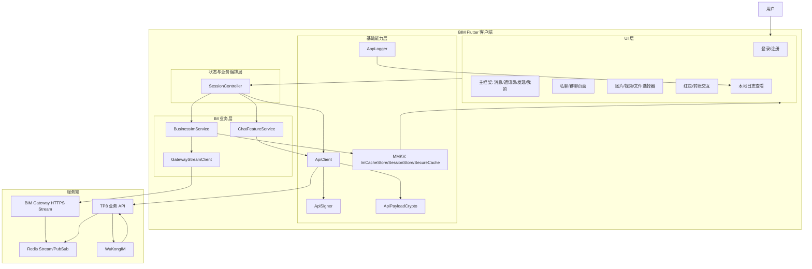
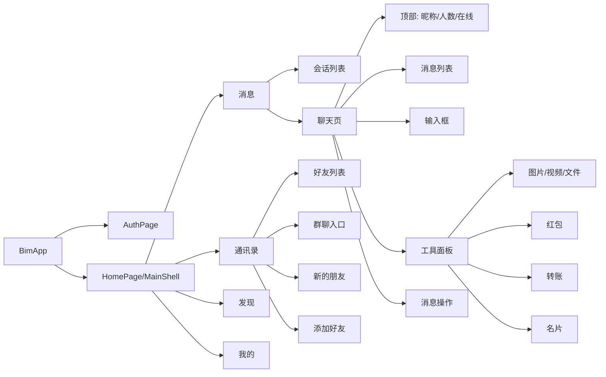
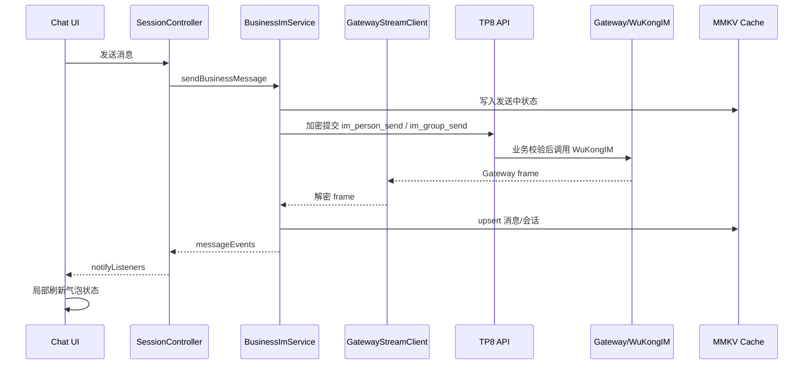
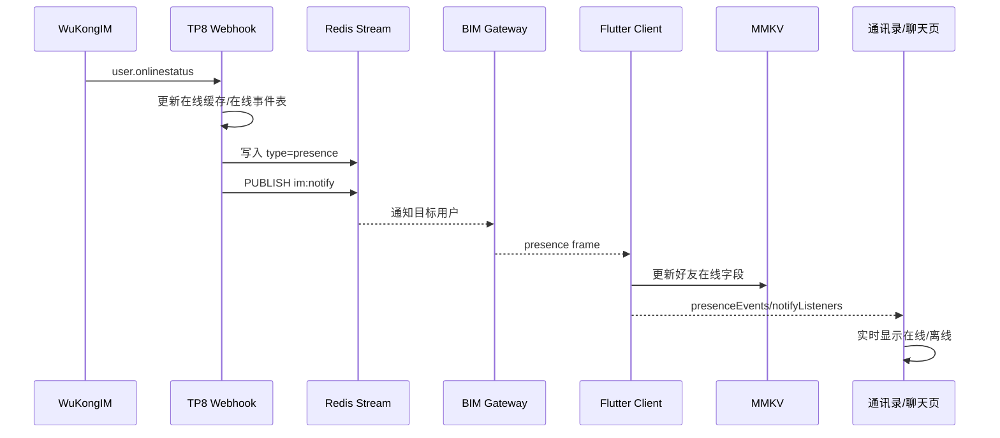
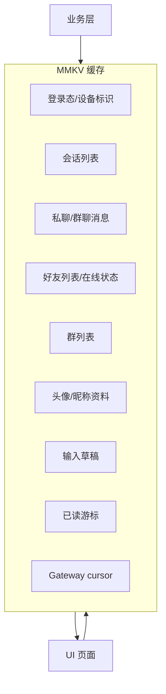

# BIM 客户端 UI 重构软件架构图

本文档用于重做 UI 前统一客户端架构认知。目标是把界面、状态、缓存、实时 IM、业务接口边界拆清楚，避免 UI 改版时破坏即时通信链路。

## 1. 总体架构



## 2. UI 页面模块图



## 3. 实时 IM 数据流



## 4. 在线状态数据流



## 5. 缓存边界



缓存原则：

- UI 优先读取本地缓存，避免进入页面闪屏。
- 业务接口返回后只更新对应模块缓存，不跨模块乱写。
- 实时消息、撤回、已读、红包、转账、在线状态都必须通过事件更新 UI。
- 开发调试期不做旧缓存迁移；发现非法缓存直接过滤或清数据重测。

## 6. UI 重构建议目录

当前 `lib/src/features/home/home_page.dart` 过大，重做 UI 时建议拆成：

```text
lib/src/features/home/
  home_page.dart
  tabs/
    messages_tab.dart
    contacts_tab.dart
    discover_tab.dart
    mine_tab.dart
  chat/
    chat_page.dart
    chat_header.dart
    message_list.dart
    message_bubble.dart
    composer_bar.dart
    tool_panel.dart
  contacts/
    contacts_page.dart
    friend_tile.dart
    group_list_page.dart
    friend_requests_page.dart
  common/
    avatar.dart
    section_header.dart
    empty_row.dart
    media_preview.dart
```

拆分规则：

- 页面只负责布局和交互。
- 状态统一走 `SessionController`。
- IM 逻辑只放 `BusinessImService` 和 `ChatFeatureService`。
- API 加密、签名、请求只放 `ApiClient`。
- 缓存只通过 `ImCacheStore/SessionStore/SecureCache`。

## 7. UI 重做约束

- 主界面保持：消息、通讯录、发现、我的。
- 风格简洁，不做阴影，不做卡片堆叠，不做大圆角。
- 聊天页必须保持即时刷新，不允许用页面重载代替局部更新。
- 消息发送状态：发送中转圈，成功单勾，已读双勾，失败感叹号可重发。
- 红包、转账、图片、视频、文件要先显示本地发送中状态，再根据服务端确认更新。
- 好友在线/离线必须由 Gateway presence 实时事件驱动。
- 群人数、群在线人数、禁言状态要显示真实服务端数据，不做假数据。

## 8. UI 重构验收点

- 冷启动能先显示缓存会话，再同步服务端。
- 进入私聊/群聊直接停在底部，不出现跳动。
- 输入法弹起时消息列表跟随顶起，不闪到顶部。
- 发送消息后输入框立即清空，气泡立即出现发送中。
- 接收方在聊天页、后台恢复、会话列表三种场景都能实时看到消息。
- 好友上线/离线不刷新页面也能更新。
- 清除聊天记录后，服务端历史不会重新拉回已清除内容。
- 红包/转账领取后只更新原消息，不创建新会话。

## 9. 当前拆分落地状态

已按第一阶段完成 `home_page.dart` 结构拆分：主入口只保留首页 Shell、底部导航、标题状态和模块 `part` 声明；消息、通讯录、发现、我的、聊天页、聊天组件、联系人页面和通用组件已拆到独立目录。

第一阶段使用 Dart `part` 保持原有私有方法和状态可见性，目的是先降低单文件复杂度且不改变 IM 行为。后续重做 UI 时，再逐步把稳定组件升级为独立 widget 文件和公开模型，避免一次性重构破坏实时消息、缓存和发送状态。

当前目录边界：

- `tabs/`：消息、通讯录、发现、我的四个首页 Tab。
- `chat/`：聊天页、聊天头部、消息列表、消息气泡、输入栏、工具面板、消息格式化。
- `contacts/`：搜索、加好友、好友申请、群聊管理、私聊操作页面和联系人 helper。
- `common/`：头像、列表项、媒体预览、通用状态块、导航 helper、基础 map/helper。
