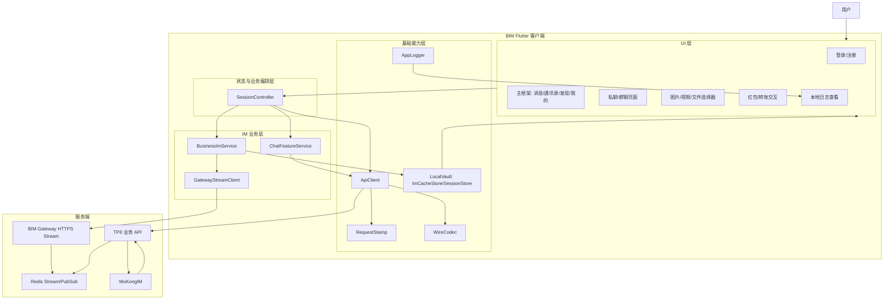
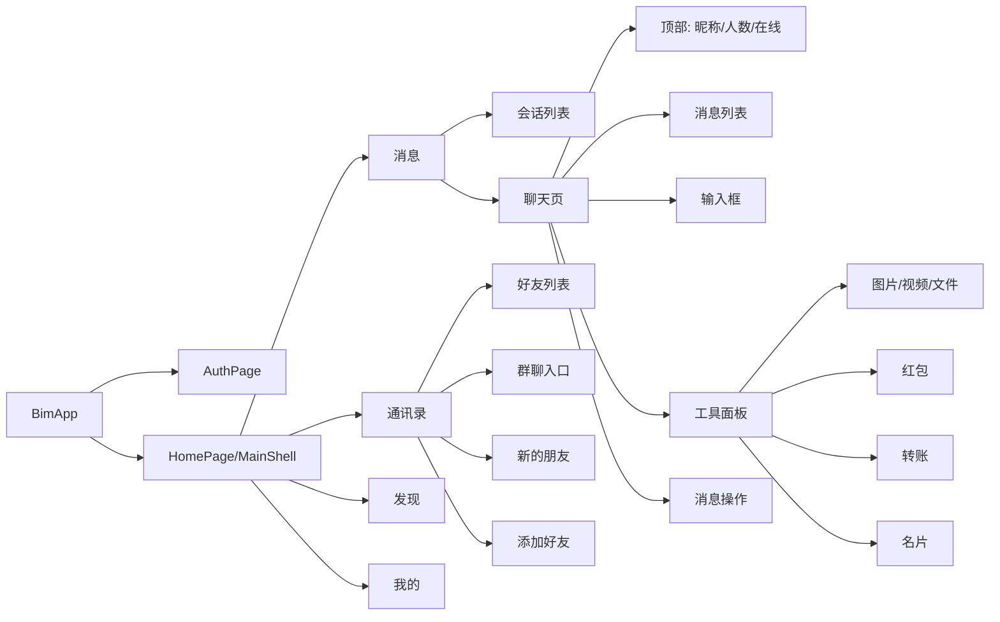
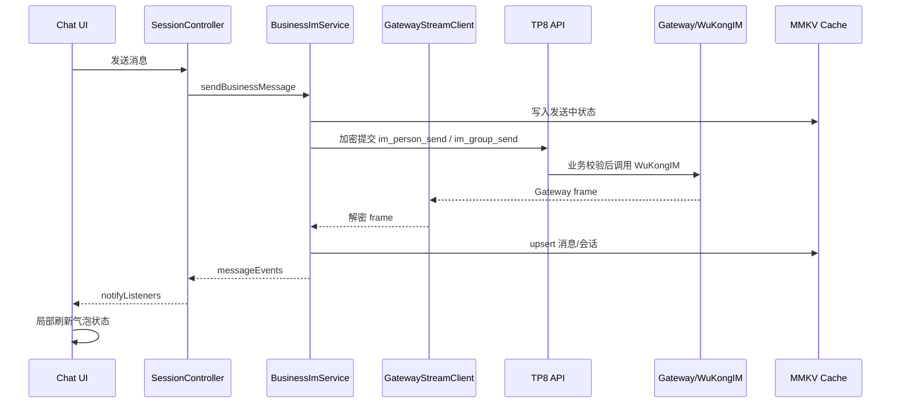
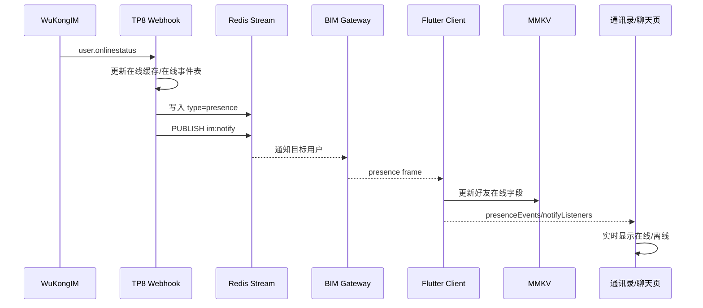
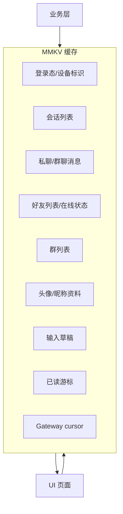

# BIM 客户端 UI 重构软件架构图

本文档用于重做 UI 前统一客户端架构认知。目标是把界面、状态、缓存、实时 IM、业务接口边界拆清楚，避免 UI 改版时破坏即时通信链路。

## 1. 总体架构



## 2. UI 页面模块图



## 3. 实时 IM 数据流



## 4. 在线状态数据流



## 5. 缓存边界



缓存原则：

- UI 优先读取本地缓存，避免进入页面闪屏。
- 业务接口返回后只更新对应模块缓存，不跨模块乱写。
- 实时消息、撤回、已读、红包、转账、在线状态都必须通过事件更新 UI。
- 开发调试期不做旧缓存迁移；发现非法缓存直接过滤或清数据重测。

## 6. UI 重构建议目录

当前 UI 已进入拆分重构阶段，稳定目录按“设计系统 -> 基础组件 -> 业务页面”分层：

```text
lib/src/design/
  tokens.dart
  theme.dart
  motion.dart
  breakpoints.dart
lib/src/ui/
  button/
  feedback/
  list/
  motion/
  navigation/
  scaffold/
  sheet/
lib/src/features/home/
  home_page.dart
  tabs/
    messages_tab.dart
    contacts_tab.dart
    discover_tab.dart
    mine_tab.dart
  chat/
    chat_page.dart
    chat_header.dart
    message_list.dart
    message_bubble.dart
    composer_bar.dart
    tool_panel.dart
  contacts/
    contacts_page.dart
    friend_tile.dart
    group_list_page.dart
    friend_requests_page.dart
  common/
    avatar.dart
    section_header.dart
    empty_row.dart
    media_preview.dart
```

拆分规则：

- `design/` 只放视觉 token、主题、动效、断点，不写业务逻辑。
- `ui/` 只放可复用基础组件，不直接调用 API、缓存、IM 服务。
- 页面只负责布局和交互。
- 状态统一走 `SessionController`。
- IM 逻辑只放 `BusinessImService` 和 `ChatFeatureService`。
- API 请求封装只放 `ApiClient`，请求签章由 `RequestStamp` 处理，传输封装由 `WireCodec` 处理。
- 本地存储入口只通过 `LocalVault` 初始化，业务缓存只通过 `ImCacheStore/SessionStore`。
- 底层工具文件使用中性命名，不出现一眼暴露传输封装、缓存保护等实现意图的文件名。

## 7. UI 重做约束

- 主界面保持：消息、通讯录、发现、我的。
- 风格简洁，不做阴影，不做卡片堆叠，不做大圆角。
- 聊天页必须保持即时刷新，不允许用页面重载代替局部更新。
- 消息发送状态：发送中转圈，成功单勾，已读双勾，失败感叹号可重发。
- 红包、转账、图片、视频、文件要先显示本地发送中状态，再根据服务端确认更新。
- 好友在线/离线必须由 Gateway presence 实时事件驱动。
- 群人数、群在线人数、禁言状态要显示真实服务端数据，不做假数据。

## 8. BIM Clean Motion 设计系统

产品气质：BIM 是高频 IM + 钱包工具，主风格应是清晰、克制、稳定、响应快。不要做营销页式大卡片、重阴影、夸张渐变和花哨装饰。

视觉规则：

- 颜色：主色只用于选中、主按钮、关键状态；聊天、联系人、钱包等高频页面以白色和浅灰背景为主。危险、红包、转账使用独立语义色，不用主色硬套。
- 字体：列表标题 15-17，正文 15，说明 12-13；聊天和钱包不使用超大标题，避免信息密度下降。
- 间距：页面横向 16 起，列表行高度固定，聊天输入区和工具面板使用稳定高度，避免键盘弹起时跳动。
- 圆角：基础控件使用 4-8，小头像和列表缩略图保持接近方形；不做大圆角卡片堆叠。
- 阴影：默认不使用阴影；需要层级时使用边线、背景分区和短动效。
- 动效：页面进入使用 220ms 以内淡入平移；按钮按压只做轻微缩放和透明度反馈；消息、回执、在线状态只局部刷新，不整页重载。
- 状态：加载、空、失败、禁用必须有统一组件；调试日志可以详细，用户端文案不能出现内部协议、Gateway、接口名等开发词。

Design Tokens 已落地在 `lib/src/design/tokens.dart`，主题在 `lib/src/design/theme.dart`，基础动效在 `lib/src/design/motion.dart`。新增页面必须优先复用这些 token，不再散落新增颜色和尺寸。

## 9. UI 重构验收点

- 冷启动能先显示缓存会话，再同步服务端。
- 进入私聊/群聊直接停在底部，不出现跳动。
- 输入法弹起时消息列表跟随顶起，不闪到顶部。
- 发送消息后输入框立即清空，气泡立即出现发送中。
- 接收方在聊天页、后台恢复、会话列表三种场景都能实时看到消息。
- 好友上线/离线不刷新页面也能更新。
- 清除聊天记录后，服务端历史不会重新拉回已清除内容。
- 红包/转账领取后只更新原消息，不创建新会话。

## 10. 当前拆分落地状态

已按第一阶段完成 `home_page.dart` 结构拆分：主入口只保留首页 Shell、底部导航、标题状态和模块 `part` 声明；消息、通讯录、发现、我的、聊天页、聊天组件、联系人页面和通用组件已拆到独立目录。

第一阶段使用 Dart `part` 保持原有私有方法和状态可见性，目的是先降低单文件复杂度且不改变 IM 行为。后续重做 UI 时，再逐步把稳定组件升级为独立 widget 文件和公开模型，避免一次性重构破坏实时消息、缓存和发送状态。

当前目录边界：

- `tabs/`：消息、通讯录、发现、我的四个首页 Tab。
- `chat/`：聊天页、聊天头部、消息列表、消息气泡、输入栏、工具面板、消息格式化。
- `contacts/`：搜索、加好友、好友申请、群聊管理、私聊操作页面和联系人 helper。
- `common/`：头像、列表项、媒体预览、通用状态块、导航 helper、基础 map/helper。

本次新增基础层：

- `design/`：全局色彩、字号、间距、尺寸、主题、路由转场和按压反馈。
- `ui/`：基础按钮、顶部栏、列表项、底部 Sheet、加载/空状态、轻量揭示动效。
- `core/`：底层文件改为 `RequestStamp`、`WireCodec`、`BinaryCodec`、`LocalVault`，避免暴露实现意图，同时保持协议字段不变。

## 11. 第二阶段首页体验规则

已落地首页低侵入优化：

- 首页四个 tab 使用懒加载保活：首次只挂载当前 tab，用户打开过的 tab 保持状态，不再每次切换都重新创建页面。
- 消息页、联系人页的搜索入口统一为 40px 高度、浅灰填充、轻按压反馈，避免搜索框透明或高度不一致。
- 首页顶部栏接入 `BimTopBar`，标题、状态栏、字号、背景统一走全局主题。
- 会话、联系人等列表的加载和空状态接入 `BimLoadingState/BimEmptyState`，避免不同页面各自画一套转圈和空文案。
- 联系人 tab 首次进入优先读取本地联系人缓存，再请求服务端刷新，减少点击联系人时先空白再闪回的问题。
- 首页快捷入口仍为悬浮菜单，不跳转到独立快捷页；菜单功能保持发起群聊、添加好友、收付款、扫一扫。

后续页面迁移规则：

- 新增或重做页面优先使用 `BimTopBar`、`BimButton`、`BimLoadingState`、`BimEmptyState`。
- 首页 tab、聊天页、钱包页、朋友圈页不能因为 UI 重构而触发整页重载来刷新局部状态。
- 列表类页面必须优先展示本地缓存，服务端刷新只做增量替换。
- 动效只用于路由、按压、加载、状态切换，不做装饰性循环动画。

## 12. 第三阶段通用页面收敛

已落地钱包、联系人相关普通页面的统一规则：

- 钱包主页、收付款、收款码、付款码、账单、账单详情、提现记录、支付表单页统一使用 `BimTopBar`。
- 服务号设置、消息连接、消息接收保护、诊断日志、搜索、添加好友、好友申请、聊天信息、查找聊天记录、个人名片、群聊资料、群成员、我的群聊等普通白底页面统一使用 `BimTopBar`。
- 钱包账单、提现记录、好友申请、搜索好友、群成员、朋友圈动态等加载态统一使用 `BimLoadingState`。
- 空账单、空提现记录等空态统一使用 `BimEmptyState`。
- 搜索页首次进入优先读取本地好友缓存，再刷新服务端，避免先空白后闪回。
- 普通操作按钮优先使用 `BimButton`，保持 48px 触控高度、统一按压反馈和禁用态。

保留例外：

- 扫一扫页面是沉浸式黑色扫描界面，顶部栏继续使用黑底样式，不套普通白底 `BimTopBar`。
- 创建群聊顶部“完成”按钮内的小转圈属于按钮内局部忙碌状态，保留在当前按钮语义内。

## 13. 第四阶段聊天与朋友圈普通页收敛

已继续收敛聊天和朋友圈相关普通页面：

- 服务号列表、联系人完整列表统一使用 `BimTopBar`，加载态使用 `BimLoadingState`。
- 聊天输入表单、红包详情、转账详情、名片选择、群通话成员选择、文件预览统一使用 `BimTopBar`。
- 红包详情、转账详情、名片选择、群成员邀请等等待状态统一使用 `BimLoadingState`。
- 聊天图片/视频/文件选择器内部 `_PickerAppBar` 已改为委托 `BimTopBar`，后续媒体选择页不会再单独维护一套顶部栏样式。
- 发表朋友圈、朋友圈图片/视频选择器统一使用 `BimTopBar`，媒体选择加载态使用 `BimLoadingState`。

继续保留的自定义场景：

- 朋友圈首页封面需要透明顶部栏和状态栏联动，保留自定义 `AppBar`。
- 朋友圈封面预览、图片预览、视频预览属于黑色沉浸式查看器，保留黑底顶部栏。
- 扫一扫属于黑色沉浸式扫描器，保留黑底顶部栏。
- 文件下载按钮需要显示实时下载中状态和百分比，保留局部自定义按钮语义。

## 14. 第五阶段基础组件沉淀

已继续把高频列表和提示样式下沉到 `lib/src/ui/`：

- 新增 `BimIconTile`：用于“我的、发现、联系人设置、钱包入口”等带图标的菜单行，统一 52px 最小高度、32px 图标容器、右侧箭头、分割线和按压反馈。
- 新增 `BimSectionHeader`：用于联系人字母分组、服务号分组、群成员选择等列表标题，统一 28px 高度、12px 字号和浅灰背景。
- 新增 `BimInlineEmptyRow`：用于列表内空行，不再每个页面单独写空行 padding、边线和文字颜色。
- 新增 `BimNoticeBanner`：用于普通成功、错误、警告、信息提示；登录错误、搜索/加好友/群管理结果提示都应逐步走这个组件。
- 新增 `BimSearchEntry`：用于消息、联系人等列表顶部搜索入口，统一 40px 高度、浅灰填充和按压反馈。
- `common/list_tiles.dart` 中的 `_MenuTile` 已委托 `BimIconTile`，后续业务调用保持不变，但视觉走基础组件。
- `common/list_tiles.dart` 中的 `_SearchBar` 已委托 `BimSearchEntry`，后续不再新增第二套搜索入口样式。
- `common/section_header.dart` 中的 `_SectionHeader/_EmptyRow/_ResultBlock/_ErrorBlock/_InfoBar` 已委托基础组件，先保持旧调用名，避免一次性改动过大。

后续迁移规则：

- 新增设置类、入口类、管理类页面时，不再复制 `_MenuTile`、`_SectionHeader`、空行和提示条代码。
- 新增搜索入口时优先使用 `BimSearchEntry`，不要在页面内临时写透明搜索框或不同高度的搜索条。
- 业务组件如果带有强语义视觉，例如红包、转账、钱包服务号卡片、媒体预览、通话浮窗，可以保留专用组件，但颜色和字号仍优先引用 `BimColors/BimTypography`。
- 沉浸式黑底页面、相机扫码、视频/图片预览不强行套普通白底组件；普通白底页面必须优先复用 `BimTopBar/BimIconTile/BimNoticeBanner/BimLoadingState/BimEmptyState`。

## 15. 第六阶段选择控件收敛

已新增 `BimSegmentedControl` 和 `BimSegmentOption`：

- 登录页的密码登录/验证码登录切换、注册方式切换已接入统一分段控件。
- 好友申请页的“收到/发出”筛选已接入统一分段控件，保留右侧刷新按钮。
- 钱包账单页的场景筛选已接入统一分段控件，使用横向滚动模式，避免小屏幕挤压。

使用规则：

- 两到三个互斥选项优先使用非滚动 `BimSegmentedControl`，让选项等宽展示。
- 四个及以上互斥选项使用 `scrollable: true`，不在小屏幕强行压缩文字。
- 不再新增散落的 `ChoiceChip`、局部 `_SegmentButton` 或自定义分段按钮；业务页面只传入选项和选中值。
- 分段控件只表达当前筛选或模式，不能承载提交、删除、支付等命令操作。

## 16. 第七阶段反馈提示收敛

已新增 `showBimSnackBar`：

- 聊天、二维码、表情、媒体选择等调用 `_showChatSnack` 的提示已统一走 `showBimSnackBar`。
- 钱包普通操作提示已统一走 `showBimSnackBar`。
- 朋友圈普通操作提示已统一走 `showBimSnackBar`。
- 登录页“暂未开放”、首页同步锁定提示、连接保护页清空/复制日志、媒体下载成功/失败提示已统一。
- 业务页面不再直接创建 `SnackBar`，目前裸 `SnackBar` 只允许存在于 `lib/src/ui/feedback/bim_snack_bar.dart`。

使用规则：

- 普通信息使用默认 `BimNoticeTone.info`。
- 成功反馈使用 `BimNoticeTone.success`，例如保存、复制、清空完成。
- 错误反馈使用 `BimNoticeTone.error`，例如下载失败、接口失败。
- 页面内长期可见状态仍使用 `BimNoticeBanner`；短暂反馈才使用 `showBimSnackBar`。

## 17. 第八阶段设置列表收敛

已新增 `BimSettingsTile` 和 `BimSettingsSwitchTile`：

- 私聊设置页的普通导航行、带值导航行、只读信息行、危险操作行和开关行已统一委托公共设置组件。
- 群设置页的普通导航行、带值信息行、危险操作行和开关行已统一委托公共设置组件。
- 服务号设置页的开关行已统一委托公共设置组件；居中动作行属于操作按钮语义，暂时保留专用实现。
- 消息接收保护页的后台接收保护开关已统一委托公共设置组件。

使用规则：

- 设置类页面的“标题 + 箭头”使用 `BimSettingsTile(title, onTap)`。
- 设置类页面的“标题 + 值 + 箭头”使用 `BimSettingsTile(title, value, onTap)`。
- 只读信息使用 `BimSettingsTile(title, value, showChevron: false)`。
- 危险操作使用 `BimSettingsTile(tone: BimSettingsTileTone.danger, showChevron: false)`，不能用普通黑色文本。
- 开关项使用 `BimSettingsSwitchTile`，不要在页面内继续直接写 `SwitchListTile` 的颜色、padding 和边线。

## 18. 第九阶段数据列表与底部菜单收敛

已继续收敛普通数据列表和底部操作菜单：

- 钱包账单列表、提现记录列表已改为 `BimListTile`，统一行高、标题/副标题字号、分割线和按压反馈。
- `BimActionSheet` 新增 `BimActionSheetItem`，用于底部操作菜单的图标、文案、危险状态统一展示。
- 会话列表长按后的置顶/删除菜单已接入 `BimActionSheetItem`。

使用规则：

- 普通“标题 + 副标题 + 右侧状态/金额”的数据列表优先使用 `BimListTile`。
- 有明显业务视觉的列表项，例如聊天气泡、红包/转账卡片、媒体网格、成员多选项，可以保留专用组件。
- 底部菜单项必须使用 `BimActionSheetItem`；删除、清空、退出等危险操作必须设置 `danger: true`。

## 19. 第十阶段基础交互状态修正

已继续修正基础组件交互状态：

- `BimPressable` 支持 `onLongPress`，长按结束会释放按压态，避免列表长按后视觉停留在缩放状态。
- `BimListTile` 支持 `onLongPress`、`titleMaxLines`、`subtitleMaxLines`，并且在只读状态下不再包裹禁用按压态，避免普通展示行被错误降透明度。
- `BimSettingsTile` 在只读状态下不再包裹禁用按压态，避免资料信息行、只读值行显示成禁用灰。
- `BimSegmentedControl` 的已选项不再走禁用按压态，避免已选标签变淡。
- `_PlainListTile` 已委托 `BimListTile`，联系人搜索、群聊管理等普通列表行统一走基础列表组件。
- 聊天记录搜索结果已委托 `BimListTile`，使用两行标题展示消息摘要。

使用规则：

- 只读展示不等于禁用控件，不要用降低透明度表达只读信息。
- 只有真正不可操作的按钮、表单控件才使用禁用透明度。
- 普通列表行需要长按时优先使用 `BimListTile(onLongPress: ...)`，不要回退到裸 `ListTile`。
- 普通搜索结果需要多行摘要时使用 `BimListTile(titleMaxLines: 2)`。

## 20. 第十一阶段可选列表行收敛

已新增 `BimSelectableTile`：

- 联系人多选行已委托 `BimSelectableTile`，头像、昵称、账号说明和选中标记统一展示。
- 群通话成员选择已委托 `BimSelectableTile`，使用 checkbox 模式，避免继续在页面内直接拼接选择行。
- `BimSelectableTile` 支持 checkmark 与 checkbox 两种控制样式，用于不同选择强度的业务场景。

使用规则：

- 联系人、群成员、服务号成员等单行多选场景优先使用 `BimSelectableTile`。
- 普通好友勾选、名片选择等轻量选择使用 `BimSelectableControl.checkmark`。
- 群通话成员、批量管理等强确认选择使用 `BimSelectableControl.checkbox`。
- 页面内不要再新增裸 `ListTile`、`CheckboxListTile` 或自己拼接一套选择标记；确实需要特殊媒体网格时，先在对应业务组件里封装清楚。

## 21. 第十二阶段错误重试空状态收敛

已继续收敛普通错误页：

- 红包/转账详情加载失败视图已改为 `BimEmptyState`。
- 支付服务号加载失败视图已改为 `BimEmptyState`。
- 朋友圈加载失败视图已改为 `BimEmptyState`。

使用规则：

- 普通“加载失败 + 重试”统一使用 `BimEmptyState(title: '加载失败', actionLabel: '重试')`。
- 页面内不要再直接拼 `Text + OutlinedButton/TextButton` 的错误重试结构。
- 带业务进度的状态页，例如首页首次历史同步遮罩，应单独沉淀同步组件，不要硬套普通空状态。
- 沉浸式图片/视频查看器、媒体上传局部失败、按钮内 busy 状态可以保留局部加载/重试语义，但颜色、间距仍应引用设计 token。

## 22. 第十三阶段付款码页面重构

付款码页面已按照资金安全和移动端展示场景重新设计：

- 新增独立 `payment_code_widgets.dart`，付款码不再复用普通收款二维码面板。
- 付款码页面统一为“安全状态标题 + 条形码 + 二维码 + 自动刷新状态 + 安全提示”的单列结构。
- 未验证状态只展示安全说明和唯一主操作，验证支付密码后才显示付款码。
- 自动刷新或接口请求失败时立即隐藏旧付款码，避免继续展示可能失效的付款凭证。
- 二维码尺寸根据可用宽度动态计算，并限制最大内容宽度，兼容小屏手机、平板和桌面窗口。
- `收付款`页面不再直接展示收款二维码和金额表单，改为付款码主区，下方提供“我的收款码”和“扫一扫”独立入口。

使用规则：

- 付款码属于短时敏感凭证，不能与普通静态二维码共用展示组件。
- 页面只能保留一个主操作；未解锁时主操作是验证，已解锁后刷新放在顶部工具栏。
- 请求失败、自动刷新失败、支付密码失效时必须遮蔽旧码，并提供明确恢复操作。
- 付款码页面不得展示开发字段、订单内部 ID、接口状态值或可复制的原始 payload。
- 条形码、二维码必须提供语义标签，图标按钮必须提供 tooltip，触控区域不低于设计系统规定尺寸。
